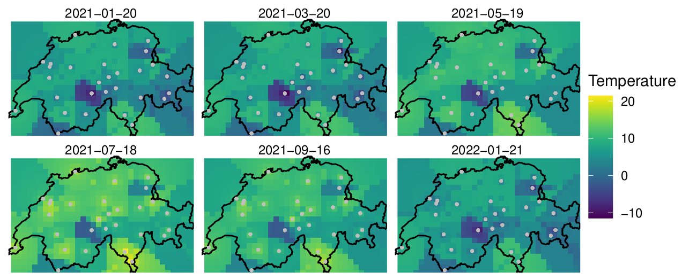

# Spatiotemporal Geostatistical Model for Temperature Forecasting in Switzerland

The model developed here has the purpose to forecast temperatures in Switzerland, and it was built using spatiotemporal geostatistical methods. The model was compared to a deep learning framework and the whole discussion can be see in the pdf attached to this repo. 

Use the RMarkdown file to run the code, and remember to use your own API Key for the OpenWeather website. 

