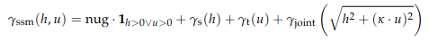

```{r setup, include=FALSE}
knitr::opts_chunk$set(echo = TRUE)
```

## Abstract

_Weather forecasting is more recently done with very robust and complex Deep Learning Frameworks that require access to not only different sources of data, but also know-how. A more parsimonious option could be a spatio-temporal geostatistical model that requires only weather stations data. We therefore aim at verifying if a spatio-temporal geostatistical model presents similar results than a Recurrent Convolutional Neural Network for daily temperature forecasting. Two main datasets are used, one from the OpenWeather API, containing current temperatures and the Neural Network forecasts and also a dataset from MeteoSwiss, containing a time series of temperatures and other variables in all weather stations in Switzerland. The spatio-temporal model has been fit using a simple sum metric variogram model with elevation and global radiance covariates. The RMSE of the spatio-temporal geostatistical models was roughly twice bigger than the one from the RCNN. Hence a more parsimonious option does not seem to be comparable to a complex Deep Learning approach yet.  _

## Introduction

Weather forecasting is a very relevant service for multiple users, from individuals to business and public institutions. The accuracy in weather forecasting is therefore of high importance and it is usually the target of many different models under usage and development. Among the many models existing, the group of Networks in a deep learning framework have been frequently used as they can allow the use of multiple sources of data. Radar data, Infrared imagery and multiple sensors are used jointly with the multiple variables being constantly measured in *in situ* weather stations. 

The problem then refers to amount of data and robustness required for these models. This is expensive and definitely requires considerable know-how and access to data. For some entities, this is either not affordable or accessible. A call for a more parsimonious option is therefore existing. 

When we look at data coming from weather stations, they present two main components : a spatial and temporal one. Every weather stations has a pair of coordinates and it measures different weather/climate related variables every *t* time. Different models that comprehend these two components in a statistical learning framework are spatio-temporal geostatistical models, such as in Blangiardo et al (2015), Gräler et al (2016) and Wikle et al (2019). This last one, e.g., makes use of the famous *gstat* package for the R programming language. This family of models requires only the weather stations data and can allow for the use of other covariates optionally. 

The use of covariates (co-kriging) for precipitation modelling, e.g., has been presented by Sideris et al (2013) showing promising results. Similarly, Fraley et al (2011) present ensemble models, including one using geostatistical simulations (ProbForecastGOP). Although different models have been tested, weather forecasting does not seem to have been tested under spatio-temporal geostatistical models, especially when considering the weather stations data as the main source of information. These models make use of the known background of geostatiscs (Matheron, 1963; Diggle & Ribeiro, 2007) and add a more complex covariance strucuture that considers the distance in both space and time jointly. How this covariance matrix is computed is explored in Gräler et al (2016).

The main question then refers to whether this more parsimonious option stands for a comparable accuracy as a Deep Learning algorithm, for instance, a Convolutional Neural Network from the OpenWeather API (OpenWeather, 2012). This framework is using satellite, radar and three different weather stations data, as well the models from NOAA and ECMWF as reference. This models evaluation was made on 371 cities around the world and presents a Mean Absolute Error around 0.5 degrees (Celsius) and a RMSE smaller than 2 degrees (Celsius) when predicting air temperature, which will also be evaluated in this work. 

Hence the main question this work tries to answer is : "To what extent do Spatio-temporal Geostatistical methods present a similar result in daily weather forecasting than more complex Machine Learning Frameworks ?"

We start from the hypothesis that a more parsimonious Spatio-temporal Geostatistical model presents similar results (without strong decay in accuracy)  when compared to RCNN (Recurrent Convolutional Neural Network) from OpenWeather for daily temperatures forecasting.

### Data

In order to be possible to compare the the results of different models and without requiring to build both, OpenWeather API allows one to access their forecasts through R and also current temperatures. 

For the spatio-temporal modelling, data from MeteoSwiss, the national weather service of Switzerland was obtained, which is publicly available through an web-service called *Map Geo Admin*. The access to the data from this source can also be done directly through R. This dataset ranges from 1836 until two days before the actual day of request and presents daily temperatures as well as elevation and radiance, among other variables. 

## Methods

In summary, the methodology of this paper follows the procedure : data acquisition (actual temperature and RCNN forecast, as well as MeteoSwiss Time series), data wrangling, spatio-temporal variogram fitting (inference) and forecasting (prediction) with covariates, comparison of computed accuracy.

The forecasting data from the OpenWeather API's deep learning framework was queried for the 21.01.2022 on the 20.01.2022 and the actual temperatures was obtained on the 21.01.2022 at different times, 9:00, 12:00, 20:00 and 23:59 (UTC +1). The data from MeteoSwiss was then making a direct http request through *wget*. It will always get the most updated data, though a subset is automatically done through the code.  

The data wrangling is then required to fit the data into a *stars* object, requiring, e.g., to transform the time feature from long to wide (Shork, 2022). It is also important to state that the data was subset to one year only (since 20.01.2021), thinking that it is the maximum time required for the spatio-temporal forecasting. 

The variogram model chosen was a Simple Sum Metric, calling a Matérn family of variograms for the spatial and jointly variograms and a Spherical for the temporal variogram. Figure 1 displays the equation for the Simple Sum Metric Model presented by Gräler et al (2016). After tests, this has shown a lower MSE and it represents an easy-to-fit option, which is important considering the objective of this work.

```{r pressure, echo=FALSE, fig.cap="Simple Sum Metric Model. Gräler et al. (2016)", out.width = '50%', fig.align='center'}

```

The forecasting of the daily mean temperature of the next day is made over the territory of Switzerland using a grid with pixel size of 10 km. This value is arbitrary as all comparison are made using the location of the weather stations themselves. Having a grid main ly allows us to visually inspect the results, checking, for instance, if spatial dependence is present or not. 

The covariates for modelling were elevation (m) and solar global radiance (W/m²). For predictions, the SRTM from NASA was used to pass the elevation values to all prediction cells and, in the case of radiance, the data from MeteoSwiss were interpolated using IDW (Inverse Distance Weighting). Once again, it is important to state that the cells of concern were those where stations were, so it could be possible to compare to RCNN. These covariates were especially chosen thinking of the the study area. Switzerland is a very mountainous area (nearly 60% of the territory is covered by mountains). Elevations present a considerable range (from 273 to 3571m, considering the stations altitude) and one can already link it its effect in shadows all over the country's surface, which is hence linked to solar radiance.

Finally, for validation, the RMSE is computed when comparing the RCNN forecasts, the Spatio-Temporal Geostatistical model forecasts to both the data from MeteoSwiss and the ones from OpenWeather API (for the 21st January, 2022).

## Results 

### Data acquisition 

As stated, the first step was to acquire the data, and the procedure to request it from the MeteoSwiss API is presented below. This procedure will download a series of CSV files for all the stations in Switzerland using *wget*, what we do then, is to read them all from the root folder.


```{r, warning=F, message=F, results='hide'}
suppressMessages(library(HelpersMG))
suppressMessages(library(tidyverse))

wget('https://data.geo.admin.ch/ch.meteoschweiz.klima/nbcn-tageswerte/liste-download-nbcn-d.csv')
down_list <- read.csv('liste-download-nbcn-d.csv', sep = ';')
wget(c(down_list$URL.Previous.years..verified.data., down_list$URL.Current.year))
current = list.files(pattern="*current.csv")
previous = list.files(pattern="*previous.csv")
current = do.call(rbind, 
                  lapply(current, function(x) read.table(
                    x, stringsAsFactors = FALSE, sep = ';', header = T)))
previous = do.call(rbind, 
                   lapply(previous, function(x) read.table(
                     x, stringsAsFactors = FALSE, sep = ';', header = T)))

dt <- rbind(current, previous)
```


Once we have our data coming from MeteoSwiss we also need to acquire the data from the OpenWeather API. First of all we get the Forecasts for the other day. As pointed out in the code chunk, this was run on the 20th of January, 2022, and in case a new request is to be made, the last lines can be "uncommented". 


```{r}
library(httr)

API_KEY = ''

down_list <- down_list[!is.na(down_list$Latitude) | !is.na(down_list$Longitude),]
lat_list <- down_list$Latitude
long_list <- down_list$Longitude

getInfoInJson <- list()
morn <- list()
day <- list()
morn <- list()
min <- list()
max <- list()
night <- list()

for (i in 1:length(long_list)){
  getInfoInJson[[i]] <- httr::GET(paste(
    'https://api.openweathermap.org/data/2.5/onecall?lat=',
    as.character(lat_list[i]),'&lon=',
    as.character(long_list[i]), paste0('&exclude=hourly,minutely&appid=', API_KEY), 
    sep = '')[1], accept_json())

  for (j in 1:8){
    morn[[i]] <- content(getInfoInJson[i][[1]], 
                         type="application/json")$daily[[j]]$temp$morn 
    day[[i]] <- content(getInfoInJson[i][[1]], 
                        type="application/json")$daily[[j]]$temp$day
    min[[i]] <- content(getInfoInJson[i][[1]], 
                        type="application/json")$daily[[j]]$temp$min
    max[[i]] <- content(getInfoInJson[i][[1]], 
                        type="application/json")$daily[[j]]$temp$max
    night[[i]] <- content(getInfoInJson[i][[1]], 
                          type="application/json")$daily[[j]]$temp$night
  }
}

morn_fore <- unlist(morn)
day_fore <- unlist(day)
min_fore <- unlist(min)
max_fore <- unlist(max)
night_fore <- unlist(night)
stations = down_list$station.location

forecast_df <- data.frame(
  cbind(stations, morn_fore, day_fore, min_fore, max_fore, night_fore))

#Run on the 20th January, 2022 at 20:26
#write.table(forecast_df, 'ml-forecast-20220121.csv', sep = ';', col.names = T)
```


With this done, we also add the current temperature data, also run before, as stated in the code chunk below. 


```{r, message=FALSE, warning=F, results='hide'}
library(ROpenWeatherMap)

#run on the 21st January, 2022 at 09:00
morn_t <- list()
for (i in 1:length(long_list)){
  morn_t[i] <- get_current_weather(API_KEY, 
                                   coordinates = c(lat_list[i], long_list[i]))$main#$temp
}

#run on the 21st January, 2022 at 12:00
day_t <- list()
for (i in 1:length(long_list)){
  day_t[i] <- get_current_weather(API_KEY, 
                                  coordinates = c(lat_list[i], long_list[i]))$main$temp
}

#run on the 21st January, 2022 at 20:00
night_t <- list()
for (i in 1:length(long_list)){
  night_t[i] <- get_current_weather('b9489729b554cf412a38e144afc54e70', 
                                    coordinates = c(lat_list[i], long_list[i]))$main$temp
}

#run on the 21st January, 2022 at 23:59
min_t <- list()
for (i in 1:length(long_list)){
  min_t[i] <- get_current_weather(API_KEY, 
                                  coordinates = c(lat_list[i], long_list[i]))$main$temp_min
}

max_t <- list()
for (i in 1:length(long_list)){
  max_t[i] <- get_current_weather(API_KEY, 
                                  coordinates = c(lat_list[i], long_list[i]))$main$temp_max
}

morn_cur <- unlist(morn_t)
day_cur <- unlist(day_t)
night_cur <- unlist(night_t)
min_cur <- unlist(min_t)
max_cur <- unlist(max_t)

current_df <- data.frame(
  cbind(stations, morn_cur, day_cur, min_cur, max_cur, night_cur))
#Run on the 22nd January, 2022 at 00:02
#write.table(current_df, 'current-20220121.csv', sep = ';', col.names = T, row.names = F)
```


### Data wrangling

Once the data has been downloaded and retrieved into memory we can start working with it. This is what we call data wrangling and, in this case we are gonna remove everything in memory despite what we will be really using, the *data frame* with spatial and temporal information as well as temperatures, elevation and global radiance.  We will also remain with the data from the measured temperatures from the 21st January, 2022, for validation.


```{r}
dt <- merge(dt, down_list, by = 'station.location', all.x = T)
rm(list=setdiff(ls(), c("dt", "current"))) #be careful!!!
```


Following we make sure the above mentioned columns are read as desired. 


```{r, warning=F}
dt$tre200d0 <- as.numeric(dt$tre200d0)#mean t
dt$tre200dn <- as.numeric(dt$tre200dn)#min t
dt$tre200dx <- as.numeric(dt$tre200dx)#max t
dt$gre000d0 <- as.numeric(dt$gre000d0)#global radiation (W/m²)
```


When downloading the data from the remote server, it dates from 12.01.1863 to usually two days sooner than the *wget* command is queued. Just to make it uniform we are limiting it from the 20.01.2021 to 20.01.2022, making it an one year data set. Then, the following steps consist in a series of data wrangling procedures to make the data fit into a *stars* object. Here we transform the dates into an ISO date format an dwe transform the data from long to wide in terms of time. 


```{r}
# subset based on dates
dt <- dt[which(dt$date <= 20220120 & dt$date >= 20210120),]
dt <- dt[,c(1,2,3,9,10,11,16,17,18)]
colnames(dt) <- c("station", "date", "radiation", "mean_temp", "min_temp", 
                  "max_temp", "elev", "long", "lat")

# data into ISO format
for (i in 1:nrow(dt)){
  dt$year[i] <- substr(as.character(dt$date[i]), 1, 4)
  dt$month[i] <- substr(as.character(dt$date[i]), 5, 6)
  dt$day[i] <- substr(as.character(dt$date[i]), 7, 8)
}

dt$date <- as.Date(paste0(dt$year,'-', dt$month, '-', dt$day))
# long to wide table 
dt_wide <- reshape(dt[,c(1,2,4)],                                 
                         idvar = "date",
                         timevar = "station",
                         direction = "wide")

dt_elev <- reshape(dt[,c(1,2,7)],                                 
                         idvar = "date",
                         timevar = "station",
                         direction = "wide")

dt_rad <- reshape(dt[,c(1,2,3)],                                 
                         idvar = "date",
                         timevar = "station",
                         direction = "wide")
# stations locations
dt_location <- dt[!duplicated(dt$station), ]

# date as index
rownames(dt_wide) <- dt_wide$date 
dt_wide$date <- NULL
rownames(dt_elev) <- dt_elev$date 
dt_elev$date <- NULL
rownames(dt_rad) <- dt_rad$date 
dt_rad$date <- NULL

dt_wide <- xts::xts(dt_wide, as.Date(rownames(dt_wide)))
dt_elev <- xts::xts(dt_elev, as.Date(rownames(dt_elev)))
dt_rad <- xts::xts(dt_rad, as.Date(rownames(dt_rad)))
```


Finally we obtain the stars object and can go for the variogram modelling. 


```{r}
# stars object
suppressMessages(library(stars))
suppressMessages(library(sf))
suppressMessages(library(zoo))
dt.sf = st_as_sf(dt_location, coords = c("long", "lat"), crs = 'EPSG:2056')
sfc = sf::st_geometry(dt.sf)
st_as_stars(temp = as.matrix(dt_wide), 
            elev = as.matrix(dt_elev), 
            rad = as.matrix(dt_rad)) %>%
	st_set_dimensions(names = c("time", "station")) %>%
	st_set_dimensions("time", index(dt_wide)) %>%
	st_set_dimensions("station", sfc) -> temp.st
```


### Variogram fitting

Now using *gstat* library we add the covariates when computing a variogram, requiring also the lags, which will be visualised further. Be aware that this can be time-demanding. 


```{r}
library(gstat)
v.st = variogramST(temp~elev+rad, temp.st, tlags = 0:15, progress = F)
```


Once we computed the empirical spatio-temporal variogram, we can also visualise it in Figure 2. 


```{r, fig.cap="Spatio-temporal Empirical Variogram, 3D (left) and 2D (right)"}
v1 = plot(v.st)
v2 = plot(v.st, map = FALSE)
print(v1, split = c(1,1,2,1), more = TRUE)
print(v2, split = c(2,1,2,1), more = FALSE)
```


We now need to fit a theoretical variogram to this empirical one by setting its main parameters (sill, range and nugget). What we aim here (3D fitted variogram - Figure 3) is to the a *ladder composition*, i.e., a smooth decay relationship from left to right and from up to down. This is verify the spatio-temporal dependence of the fitted variogram. After tests, a Simple Sum Metric model has been chosen and its definition can be checked below. 


```{r, fig.cap="3D Spatio-temporal Theoretical Variogram", out.width = '80%', fig.align='center'}
pars.l <- c(sill.s = 0, range.s = 1, nugget.s = 0, sill.t = 0, range.t = 1, 
            nugget.t = 0.000001, sill.st = 0, 
            range.st = 1, nugget.st = 0, anis = 0)
summetric <- vgmST("simpleSumMetric",
                   space = vgm(15,"Mat", 80000, 1),
                   time = vgm(15,"Sph", 15000, 0), 
                   joint = vgm(15,"Mat", 4000, 1), nugget=0, stAni=500) 
SimplesumMetric_Vgm <- fit.StVariogram(v.st, summetric, 
                                       method = "L-BFGS-B",lower=pars.l)
plot(v.st, SimplesumMetric_Vgm, wireframe = FALSE, all = TRUE, 
     scales = list(arrows=FALSE), zlim = c(0,150))
```


The same way we can see the 2D theoretical variogram in Figure 4.


```{r, fig.cap="2D Spatio-temporal Theoretical Variogram", out.width = '80%', fig.align='center'}
plot(v.st, SimplesumMetric_Vgm, map = F, wireframe = FALSE, all = TRUE, 
     scales = list(arrows=FALSE), zlim = c(0,150))
```


### Prediction

Being the model set, the next step is to pass predictions to surface of Switzerland. We'll do that by using the vector file fo the borders of the country and by creating a grid of points inside it every 10 km. 

```{r, message=F, warning=F, results='hide'}
t = st_get_dimension_values(temp.st, 1)
t4 = c(t[1], t[60], t[120], t[180], t[240], t[length(t)]+1)

ch <- st_read('swiss-border.geojson')
st_bbox(ch) %>%
  st_as_stars(dx = 10000) %>%
  st_crop(ch) -> grd
d = dim(grd)
grd.pts <- st_as_sf(grd, as_points = T)
```


As required by the *gstat* library, we should then also add the covariates to these grid points. Just to remember, we are using the SRTM elevation model and the IDW interpolation of the solar radiance values. 


```{r, warning=F, message=F, results='hide'}
# add elevation to all prediction points
dtm <- raster::raster('swiss-srtm.tif')
coords = sp::coordinates(as(grd.pts, "Spatial"))
elev_values <- raster::extract(dtm, coords)

# add solar incidence to all points
temp.sf.last <- dt[which(dt$date == max(dt$date)),]
temp.sf.last = st_as_sf(temp.sf.last,
                   coords = c("long", "lat"), crs = "EPSG:2056")
rad <- idw(radiation~1, temp.sf.last, grd)
names(rad)[1] = "radiance"
rad$var1.var <- NULL
rad_values <- raster::extract(as(rad, "Raster"), coords)
st_as_stars(pts = array(1, c(d[1], d[2], time = length(t4))), 
            elev = array(elev_values, c(d[1], d[2], time = length(t4))),
            rad = array(rad_values, c(d[1], d[2], time = length(t4)))
            ) %>%
    st_set_dimensions("time", t4) %>%
    st_set_dimensions("x", st_get_dimension_values(grd, "x")) %>%
    st_set_dimensions("y", st_get_dimension_values(grd, "y")) %>%
    st_set_crs("EPSG:2056") -> grd.st
```


Prediction are then passed to the created grid. 


```{r, warning=F, message =F, results='hide'}
new_int <- krigeST(temp~1-elev*rad, data = temp.st, newdata = grd.st,
         nmax = 200, modelList = summetric,
         progress = F, getOption("mc.cores", 4))
names(new_int)[4] = "Temperature"

temp.sf = st_as_sf(dt, coords = c("long", "lat"), crs = "EPSG:2056")
```


We can now see the resulting surface of mean temperature on the 20th and 21st of January, 2022 (Figure 5). 


```{r, fig.cap="Interpolated Mean Temperature and forecasted temperature on the validation date (21st of January, 2022) - down-right corner, in Switzerland", message=F, warning=F}

library(ggplot2)
g = ggplot() + coord_equal() +
    viridis::scale_fill_viridis() +
    theme_void() +
    scale_x_discrete(expand=c(0,0)) +
    scale_y_discrete(expand=c(0,0))

g + geom_stars(data = new_int, aes(fill = Temperature, x = x, y = y)) + 
    facet_wrap(~as.Date(time)) +
    geom_sf(data = st_cast(ch, "MULTILINESTRING")) + 
    geom_sf(data = temp.sf, col = 'grey', cex = .5) + 
    coord_sf(lims_method = "geometry_bbox")
```


As an additional point, by evaluating the predictions, one major issue was encountered. As we are dealing with a spatio-temporal model using a covariance matrix for both dimensions, time steps there are too close from the limits (beginning and end of time-series) presented to be very linear, with no fluctuation in days. The main question is then whether this kind of model is or not appropriate for forecasting (extrapolation), in spite of interpolation in between the range of data. 

This phenomenon can be observed in the Figure 6, which exposes the time series of 10 random points inside Switzerland's created grid of prediction points. Just to add, this was computed without considering the covariates, although they are static through time, and therefore they should not change the results of this figure abruptly.


```{r, warning=F, message=F, fig.cap="Time Series of 10 random points inside Switzerland. This demonstrates the limitations of this model in extrpolation", out.width="60%", fig.align='center'}
pt = st_sample(ch, 10)
t = st_get_dimension_values(temp.st, 1)
st_as_stars(list(pts = matrix(1, length(t), length(pt)))) %>%
    st_set_dimensions(names = c("time", "station")) %>%
    st_set_dimensions("time", t) %>%
    st_set_dimensions("station", pt) -> new_pt
new_ts <- krigeST(temp~1, data = temp.st["temp"], newdata = new_pt,
         nmax = 50, modelList = summetric,
         progress = F)
plot(xts::as.xts(new_ts[2]), main = "10 random location time series")
```


### Validation and Comparison

Remembering that we created two CSV files from the current tmeperature and forecasted temperatures from the OpenWeather API, we can now read those files and join them for comparing the results. 


```{r}
# add as raster
ml_pred <- read.table('ml-forecast-20220121.csv', sep = ";", header = T)
ml_pred$morn_fore <- as.numeric(ml_pred$morn_fore)
ml_pred$day_fore <- as.numeric(ml_pred$day_fore)
ml_pred$max_fore <- as.numeric(ml_pred$max_fore)
ml_pred$night_fore <- as.numeric(ml_pred$night_fore)
ml_pred$mean_fore <- rowMeans(ml_pred[,c(2:6)])

val <- st_as_sf(merge(ml_pred, dt.sf, by.x = "stations", by.y = "station"), 
                crs = 'EPSG:2056')
val <- as(val, "Spatial")
new_int$pts <- NULL
new_int$elev <- NULL
new_int$rad <- NULL
rst <- as(new_int, "Raster")
val$st_pred <- raster::extract(rst$layer.1, val)
val$mean_fore <- val$mean_fore - 273

#read current
current_error <- read.table('current-20220121.csv', sep=";", header = T)
current_error$mean_temp <- rowMeans(current_error[, c(2:6)] - 273)

# errors
current <- current[which(current$date == 20220121),]

error_df <- data.frame(cbind(current_forecast = val$mean_fore-current_error$mean_temp, 
                         data_forecast = val$mean_fore-current$tre200d0, 
                         current_stpred = val$st_pred-current_error$mean_temp, 
                         data_stpred = val$mean_temp-current$tre200d0))


```


In the end, so we can compute the RMSE of the forecasts, we can compare to the data from MeteoSwiss itself and the one retrieved from the OpenWeather API. The following graph demonstrates the computed RMSE for the RCNN when compared to the data from the OpenWeather API (DL API); and compared to the MeteoSwiss data (DL MeteoSwiss); and the Spatio-temporal framework forecast when compared to the OpenWeather API data (ST API); and finally, compared to MeteoSwiss data (ST MeteoSwiss).


```{r, out.width = '60%', fig.align='center'}
rmse <- function(ls){
  e = round(sqrt((mean(ls))**2), 2)
  return(e)
}

errors <- data.frame(cbind(rmse = c(rmse(error_df$current_forecast),
                      rmse(error_df$data_forecast),
                      rmse(error_df$current_stpred),
                      rmse(error_df$data_stpred)), 
                      model = c("DL API", "DL MeteoSwiss", 
                                "ST API", "ST MeteoSwiss")))

ggplot(errors, aes(x=model, y=rmse, fill=model)) +
  geom_bar(stat="identity")

```


The MSE can be retrieved from the model itself through the code below.


```{R}
round(attr(SimplesumMetric_Vgm, "MSE"), 2)
```


## Discussion

Organising and Modelling the data through a spatio-temporal model has been successful and this was done with the stated covariates and a pretty interesting interpolation surface has been generated in the end. Nevertheless the RMSE from the spatio-temporal geostatistical models has been approximately the double of the ones from the RCNN. The same happens to what's described in the RCNN documentation and to what we found in the geostatistical model's MSE. The RMSE for this specific date was a bit bigger than the one documented, although this is the theme of the next discussion point. 

We made the validation for one single day only. This is definitely too not enough for a full comparison. This happens because querying for the RCNN forecasts can only be done for the next day. This requires a scheduled procedure to get data. Data for two other days was also queried, although then the whole spatio temporal procedure must be run again twice, as we need to add the fill the dataset with all the data until that point in time, once we are comparing daily forecasts and the longer you are in time, the higher the inaccuracy of predictions. At least, there were two different datasets for the purpose of comparison and they showed up to be very similar, which only represents the quality of both data providers. 

A third point to add is the use of one year data. This was an arbitrary decision and could surely affect results. Maybe only the last weeks before the forecast day could be enough as dependence is the highest or using the whole dataset may add the seasonality to modelling. This is then also a recommendation for further tests. This becomes even more complicated considering the results seen in Figure 6, which questions the capability of the spatio-temporal geostatistical framework in extrapolating.

When coming back to research question we can then state that, considering the data used for validation, there is a significant decay in results when comparing a robust RCNN to a spatio-temporal geostatistical model for daily weather forecasting and going for a more parsimonious option still does not seem to be viable.


## Conclusion

A spatio-temporal geostatistical model has been compared to a RCNN for weather forecasting and a significant different between these two models could be observed. Despite the fact that the geostatistical model presents a high quality visual performance, its results were significantly different than those presented by a RCNN in therms of RMSE. The accuracy is roughly doubled when using a RCNN (from OpenWeather API) than when using geostatistics. 

Hence we conclude that using a more parsimonious model for weather forecasting still requires improvement and tuning, which is recommended to be done through new test, using, e.g., a different time gap. Moreover, further investigating the limitations of this framework to what concerns extrapolation is required.

\pagebreak

## References

Blangiardo, Marta & Cameletti. 2015. Spatial and Spatio-Temporal Bayesian Models with R-Inla. John Wiley & Sons.

Diggle, P. J. Ribeiro., P. J. (2007). Model-based Geostatistics. Springer Series in Statistics.

Fraley, C., Raftery, A., Gneiting, T., Sloughter, M., & Berrocal, V. (2011). Probabilistic Weather Forecasting in R. R Journal, 3(1).

Gräler, B., Pebesma, E., & Heuvelink, G. 2016. “Spatio-Temporal Interpolation using gstat.” The R Journal 8 (1): 204–18. https://doi.org/10.32614/RJ-2016-014.

Matheron, G. Principles of geostatistics. (1963). Economic geology, 58(8), 1246-1266.

OpenWeather. (2012). Available in https://openweathermap.org/accuracy-and-quality. Acessed in January, 2022. 

Pebesma, E., & Gräler, B. (2021). Introduction to spatio-temporal variography. University of Münster: Münster, Germany.

Schork, J. (2021). (https://statisticsglobe.com/reshape-data-frame-from-long-to-wide-format-in-r)

Sideris, I. V., Gabella, M., Erdin, R., & Germann, U. (2014). Real‐time radar–rain‐gauge merging using spatio‐temporal co‐kriging with external drift in the alpine terrain of Switzerland. Quarterly Journal of the Royal Meteorological Society, 140(680), 1097-1111.

Wikle, C. K, Andrew Z., Cressie, N. (2019). Spatio-Temporal Statistics with R. CRC Press.

